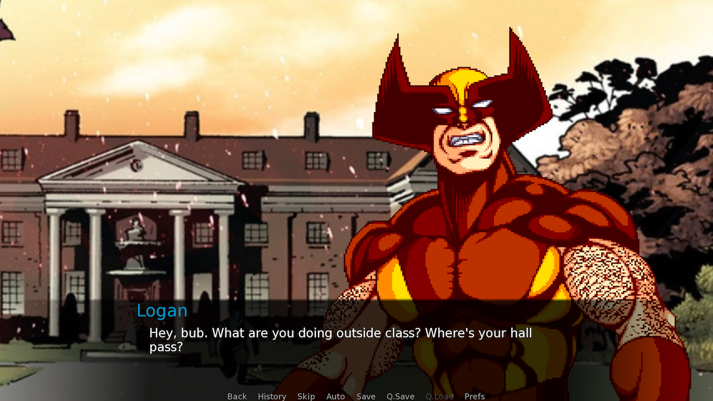

# X-Men Dating Origins: Wolverine

This is a visual novel I made as a fan game for [The Mutant Ages](https://twitter.com/themutantages) podcast. It's an in-joke. The best attempt I can make to explain it is to refer you to [the podcast segment it's based on](https://soundcloud.com/themutantages/ep-37-phoenix-saga-part-5-child-of-light-x-men-tas#t=49:36). However, if you have fantasies about dating Wolverine and are not a fan of the podcast (even though, in that case, you definitely should be) you may also enjoy this game!

Please play with the sound on, I think it really adds a lot.

[Download here.](https://github.com/fadookie/mutant-ages-dating-sim/releases/tag/1.0)

[Maddy and Ryan from the Mutant Ages did a blind playthrough video here](https://www.youtube.com/watch?v=DceCykxJRo8). It was a blast to watch, although keep in mind that it's a short game so this video will basically spoil the whole thing!

## Developer notes
Made with [Ren'Py](https://renpy.org/) 7.1.1.929.

You are welcome to use the code, such as it is, as reference for your games. However, this is basically a quick prototype I slapped together, and as such I do not own most of the assets for this game. Some of them are available under copyleft licenses, please see the in-game About screen for more details on that.
